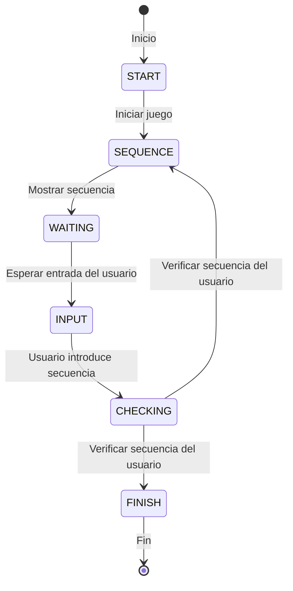

# Proyecto Simon Dice

Este proyecto es una copia del juego Simon Dice en Kotlin utilizando Android Studio. El juego consiste en seguir una secuencia de colores que se va incrementando en cada ronda correcta.

## Clases Principales

### MainActivity.kt
Esta es la clase principal de la aplicación. Aquí se inicializa el ViewModel y se establece el contenido de la interfaz de usuario. Esta clase hereda de `ComponentActivity`, que es una clase base para actividades que usan la biblioteca de Jetpack Compose.

### Data.kt
Esta clase contiene la lógica de datos del juego. Aquí se definen los estados del juego, los colores y las secuencias de usuario y bot. Esta clase utiliza `MutableState` para manejar el estado mutable en Compose. También define dos enumeraciones, `MyColors` y `State`, que representan los colores del juego y los estados del juego, respectivamente.

### MyViewModel.kt
Esta clase contiene la lógica del juego. Aquí se generan las secuencias aleatorias, se verifica la secuencia del usuario y se manejan los estados del juego. Esta clase hereda de `ViewModel`, que es una clase diseñada para almacenar y gestionar datos relacionados con la UI de manera consciente del ciclo de vida.

### UI.kt
Esta clase contiene la interfaz de usuario del juego. Aquí se definen los botones, el registro y la ronda. Utiliza la biblioteca de Jetpack Compose para definir la UI de la aplicación.

## Estados del Juego

El juego tiene varios estados, definidos en el archivo `Data.kt`:

- `START`: Este es el estado inicial del juego. Cuando el juego está en este estado, el usuario puede iniciar una nueva ronda.

- `SEQUENCE`: En este estado, el juego muestra la secuencia de colores que el usuario debe seguir.

- `WAITING`: Este es el estado en el que el juego espera la entrada del usuario.

- `INPUT`: En este estado, el usuario está introduciendo la secuencia de colores.

- `CHECKING`: En este estado, el juego verifica si la secuencia introducida por el usuario es correcta.

- `FINISH`: Este es el estado final del juego. Si el usuario introduce una secuencia incorrecta, el juego pasa a este estado.

El juego comienza en el estado `START` y transita entre los estados en respuesta a las acciones del usuario y del bot.

## Diagrama de estado
